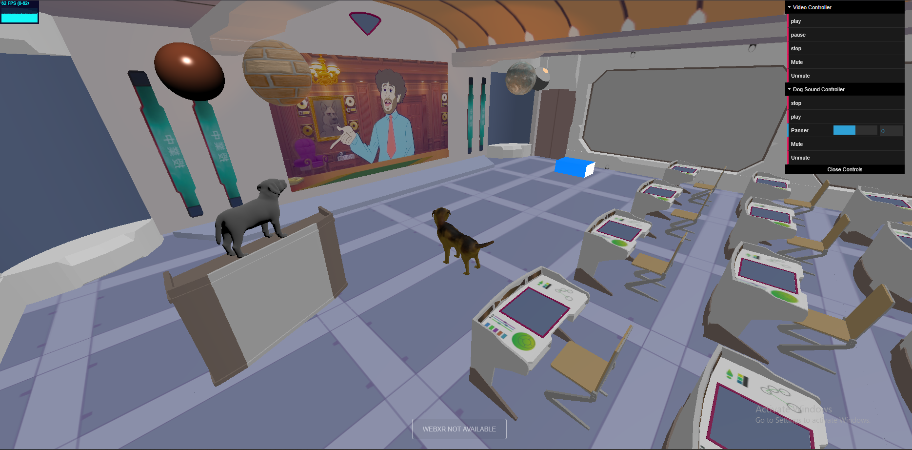
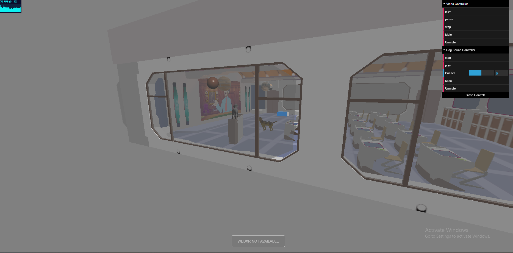
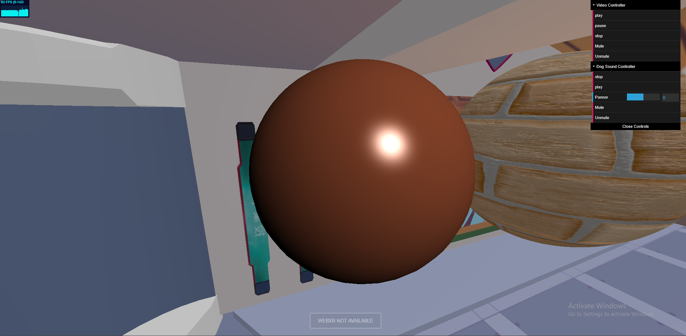
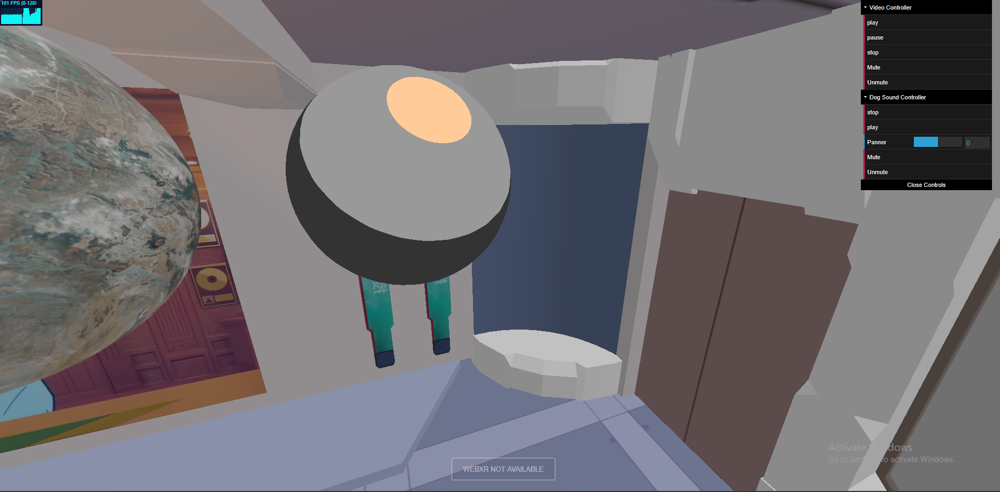
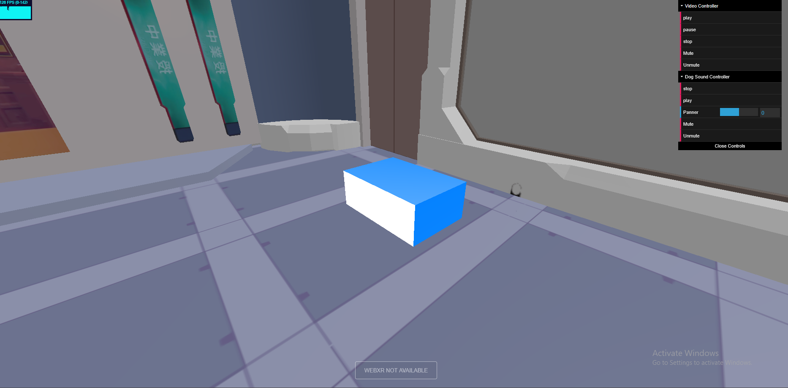
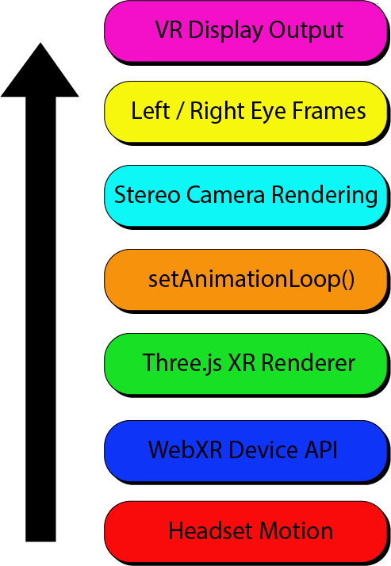
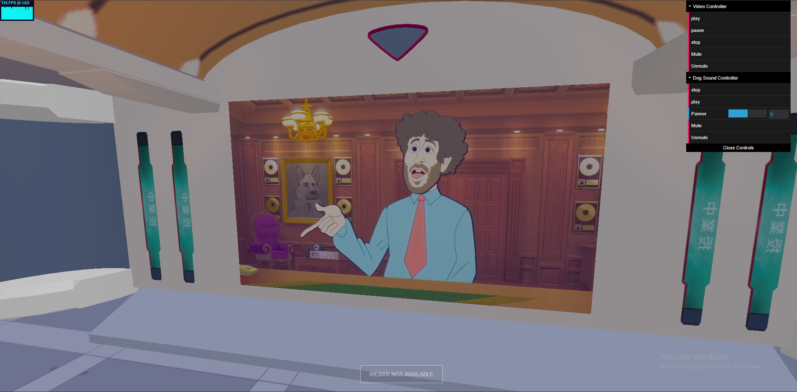
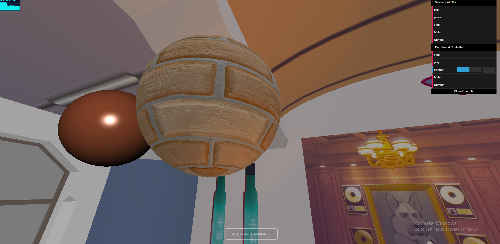
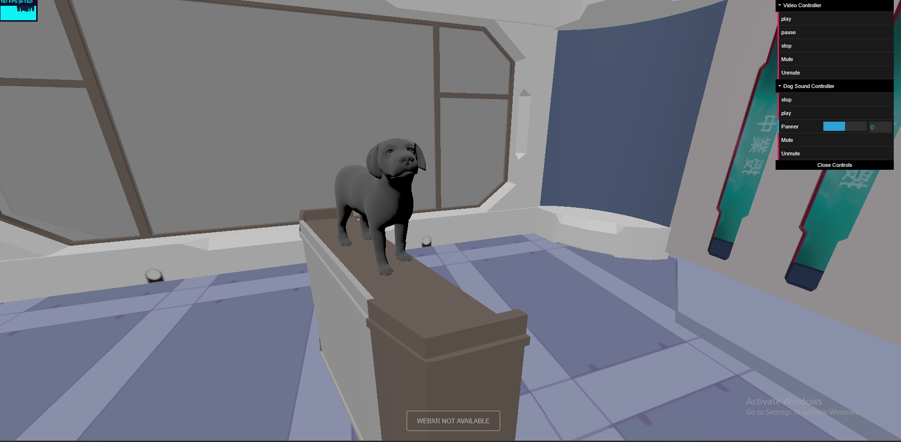
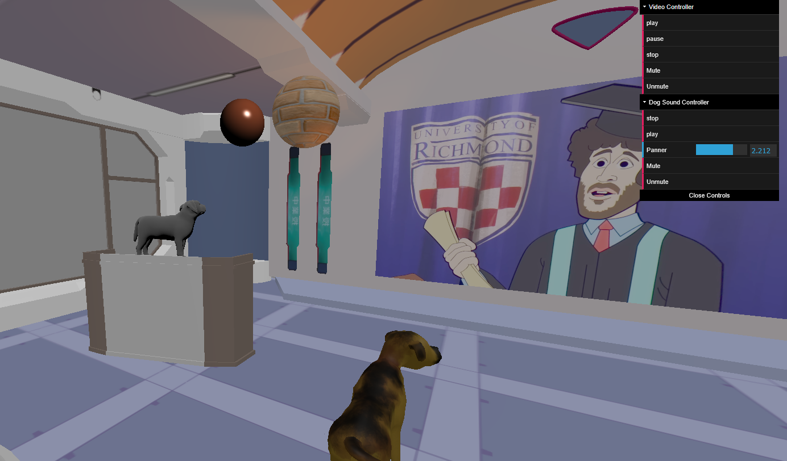

# Three.js-WebXR Virtual Classroom



An interactive browser-based virtual classroom developed with Three.js and WebXR technologies, demonstrating real-time 3D rendering, custom GLSL shader programming, multimedia integration, spatial audio systems, and immersive VR-ready web experiences.

This project combines animated GLB assets, physically-inspired material workflows, custom vertex and fragment shader implementations, video-texture rendering, positional audio, and frame-rate independent animation systems inside a fully interactive 3D environment. The application was designed as a multimedia learning environment that can be experienced both through traditional desktop interaction and compatible WebXR/VR devices.
## Technical Highlights
- WebXR integration for immersive browser-based VR experiences
- Custom GLSL shader implementations including:
    - Phong-style lighting shader
    - Toon/Cel shading shader
    - Fresnel edge-lighting shader
- Real-time rendering pipeline using Three.js
- Animated GLB/gltf models with AnimationMixer support
- VideoTexture implementation for dynamic in-scene video playback
- Positional audio and spatial sound integration using the Web Audio API
- Multi-texture material workflows using:
    - Albedo maps
    - Normal maps
    - Displacement maps
    - Ambient Occlusion (AO) maps
- Runtime GUI interaction system using dat.GUI
- Interactive keyboard and multimedia controls
- Dynamic lighting system with ambient, directional, and spotlight configurations
- Frame-rate independent animation loop for consistent real-time behavior
- GPU-based shading and material customization through custom ShaderMaterial pipelines
## Technologies Used

- Three.js
- WebXR API
- GLSL (OpenGL Shading Language)
- JavaScript (ES Modules)
- Web Audio API
- Blender
- GLTF/GLB asset pipeline
- dat.GUI
- Stats.js

## Features
The virtual environment includes animated character models, interactive multimedia controls, real-time shader demonstrations, dynamic texture systems, spatial audio positioning, and VR-compatible rendering workflows. The project emphasizes both artistic rendering techniques and low-level graphics programming concepts commonly used in modern interactive media and real-time visualization applications.

## Shader Showcase
### Phong Shader

Implements diffuse and specular lighting calculations using custom GLSL fragment and vertex shaders.

- Phong-like shading combines:
    - Ambient (Base illumination)
    - Diffuse (Surface Brightness)
    - Specular (Shiny highlights)

Specular reflections simulate glossy materials such as polished metals or wet surfaces, while lambertian diffuse lighting models light scattering across rough materials such as concrete, cloth or matte paint.

### Toon Shader

Uses quantized lighting bands to achieve a stylized non-photorealistic rendering effect. It also intentionally removes smooth gradients in order to achieve cartoon/anime looking patterns.

### Fresnel Shader

Implements edge-based, view-dependent reflectivity inspired by Fresnel reflectance principles.

In real world Fresnel, surfaces reflect more light at grazing angles. 

In Computer Graphics Fresnel is often used for holograms, force fields, glowing outlines, glass and etc. It looks Sci-Fi (centers are darker, edges are glowing), creates a stylized futuristic appearance.

## WebXR Integration
The project integrates WebXR through Three.js' XR rendering pipeline, enabling immersive browser-based VR experiences compatible with supported XR devices.

WebXR requires special timing synchronization. WebGLRenderer method called `setAnimationLoop()` integrates with XR devices properly. Hence why the renderer uses `renderer.xr.enabled = true` along with `renderer.setAnimationLoop()` to synchronize rendering with XR headset frame timing and motion tracking.

```js
function animate() {
    renderer.setAnimationLoop( function () { 
        scene.getObjectByName('sphere').rotation.y += 0.00035; 
        scene.getObjectByName('clouds').rotation.y += 0.0008;
        scene.getObjectByName('mtxMesh').rotation.y += 0.0005;
        if(mixers) {
            mixers.forEach((mixer,i)=>{
            mixer.update(clocks[i].getDelta())}); 
    }
                controls.update(); 
                renderer.render(scene, camera); 
                stats.update();
    } );
} 
```
## VideoTexture Integration

The project integrates real-time video playback into the 3D environment using `THREE.VideoTexture`. Instead of rendering video as a traditional HTML overlay, the video stream is converted into a GPU texture and dynamically mapped onto a PlaneGeometry object inside the virtual classroom.

This workflow enables multimedia content to exist as part of the immersive 3D scene and remain compatible with the WebXR rendering pipeline.

- XR compatible Video Rendering Pipeline consists of:
    - Retrieving the HTML Video Element from the DOM
    - Creating a dynamic GPU texture (`THREE.VideoTexture`) from the video frames.
    - Allowing the video to act as a texture that reacts to light and using video frames as surface textures by implementing `MeshLambertMaterial` on `VideoTexture`.
    - Attaching the video material to the `PlaneGeometry`.
    - Virtual screen display! The video is no longer a plain webpage media, it becomes the part of the rendered 3D world.

The implementation uses texture filtering adjustments and runtime playback controls to improve visual quality and user interaction.
```js
function playVideo() {
    video = document.getElementById('videoPlayer');
    const videoTex = new THREE.VideoTexture(video);
    videoTex.generateMipMaps = false; 
    videoTex.minFilter = THREE.LinearFilter; 
    videoTex.magFilter = THREE.LinearFilter;
    videoTex.format = THREE.RGBAFormat;
    const videoMat =  new THREE.MeshLambertMaterial({ map: videoTex });
    plane.material = videoMat; 
    video.style.display = 'none';
    playAudio();
}
```
The multimedia system is additionally integrated with GUI controls and keyboard interactions for playback, pause, mute, and stop functionalities.
## Positional Audio System
The project integrates spatialized audio using the Web Audio API through Three.js' `THREE.PositionalAudio` system. Unlike traditional stereo playback, positional audio simulates real-world sound behaviour by dynamically adjusting volume and directional perception according to the listener's position inside the 3D environment. 

The implementation combines `THREE.AudioListener`, `THREE.AudioLoader`, and `THREE.PositionalAudio` to create an immersive sound system compatible with both desktop and WebXR rendering workflows.

- XR compatible Positional Audio Pipeline is structured as follows:
    - Creating an audio listener with `THREE.AudioListener()` to represent the user's hearing position inside the 3D scene.
    - Attaching the audio listener to the camera so the perceived sound changes according to the user's position and viewing direction.
    - Loading the audio file asynchronously with `THREE.AudioLoader`.
    - Creating a spatial sound source with `THREE.PositionalAudio(listener)`
    - Assigning the loaded audio buffer to the positional audio object using `posSound.setBuffer(buffer)`.
    - Defining distance-based sound behavior with `posSound.setRefDistance(10)`.
    - Attaching the positional audio object to a 3D object in the scene, allowing the sound to originate from that object's position.
    - Spatialized audio output! The sound is no longer plain background audio; it becomes part of the 3D environment and reacts to listener movement, distance, and orientation.

Since the positional sound source is attached to a 3D object within the scene, realistic spatial attenuation and directional sound perception is enabled as the user navigates throughout the environment.
```js
const listener = new THREE.AudioListener();
camera.add(listener);

const posSound = new THREE.PositionalAudio(listener);
const audioLoader = new THREE.AudioLoader();

audioLoader.load('./assets/dog.mp3',
    function(buffer){

    posSound.setBuffer(buffer);
    posSound.setRefDistance(10);

    cube.add(posSound);
});
```
Additionally, runtime GUI controls were implemented using dat.GUI to allow interactive playback, mute/unmute functionality, and dynamic positional adjustments of the sound source during execution.
## Multi-Texture / PBR-Style Material Workflow

The project implements a multi-texture material workflow using `THREE.MeshStandardMaterial`, combining several texture maps to create a more detailed and physically-inspired surface appearance.

Instead of relying on a single image texture, the material uses different maps to describe different surface properties such as base color, surface depth, lighting response, and shadowing detail.

- The implementation of PBR-style texture includes:
    - Loading the albedo map to define the base surface color.
    - Loading the normal map to simulate small bumps and dents through lighting calculations.
    - Loading the displacement map to physically offset surface vertices and create geometric depth.
    - Loading the Ambient Occlusion map to add soft shadowing information into cracks and recessed areas.
    - Combining these maps inside `THREE.MeshStandardMaterial`.
    - Rendering a visually richer material without manually modeling every small surface detail.
```js
const textLoader = new THREE.TextureLoader(loadingManager);

const colTexture = textLoader.load('./assets/brick-wall_albedo.png');
const normalTexture = textLoader.load('./assets/brick-wall_normal-ogl.png');
const heightTexture = textLoader.load('./assets/brick-wall_height.png');
const aoTexture = textLoader.load('./assets/brick-wall_ao.png');

const material = new THREE.MeshStandardMaterial({
    map: colTexture
});
material.normalMap = normalTexture;
material.displacementMap = heightTexture;
material.displacementScale = 0.004;
material.aoMap = aoTexture;
material.aoMapIntensity = 0.35;
```

## Animation System with GLTFLoader and AnimationMixer


The project integrates animated GLB/gltf assets using `GLTFLoader` and Three.js' `AnimationMixer` system. The imported models contain pre-animated skeletal armatures created and adjusted in Blender before being exported into the real-time rendering pipeline.

The animation system allows animated 3D assets to be synchronized with the rendering loop and updated continuously during execution. This enables the virtual environment to feel more dynamic and immersive rather than consisting only of static geometry.
- Animation system workflow consist of:
    - Importing animated GLB/gltf assets using `GLTFLoader`.
    - Extracting embedded animation clips from the imported models.
    - Creating an `AnimationMixer` for each animated model.
    - Playing animation clips through `mixer.clipAction().play()`.
    - Synchronizing animation timing with the rendering loop using `Clock.getDelta()`.
    - Updating animation states continuously inside `renderer.setAnimationLoop()`.
    - The imported models become continuously animated scene components integrated into the WebXR rendering workflow.
```js
const loader = new GLTFLoader();

loader.load(path, function(gltf){
     models.push(gltf.scene);

    if (gltf.animations.length > 0) {
        let mixer = new THREE.AnimationMixer(gltf.scene);
        mixer .clipAction(gltf.animations[0]) .play();

        mixers.push(mixer);
    }
});
```
The animation mixers are updated continuously inside the rendering loop using frame-rate independent delta timing:
```js
if(mixers) {
    mixers.forEach((mixer,i)=> {
        mixer.update(clocks[i].getDelta())
    });
}
```
Using delta-time synchronization ensures that animations remain consistent across different hardware configurations and frame rates, which is particularly important for real-time WebXR and browser-based rendering environments.

## Rendering Loop & Frame-Rate Independent Updates

The project uses Three.js' `renderer.setAnimationLoop()` method as the main real-time rendering loop. This loop continuously updates scene elements, synchronizes animated models, refreshes camera controls, renders the scene, and updates performance statistics.

Unlike a static webpage that renders once, a real-time 3D environment must continuously redraw the scene to support animation, interaction, camera movement, and WebXR device tracking.

- Real-time Rendering Loop operates as follows:
    - Updating rotating scene objects such as the textured spheres and cloud layer.
    - Updating imported GLB/gltf animations through `AnimationMixer`.
    - Using `Clock.getDelta()` to keep animation timing frame-rate independent.
    - Updating camera orbit controls for interactive navigation.
    - Rendering the scene from the active camera.
    - Updating `Stats.js` for real-time performance monitoring.
    - Continuous rendering output! The scene behaves like an interactive real-time application rather than a static 3D render.
```js
function animate() {
    renderer.setAnimationLoop(function () {

        scene.getObjectByName('sphere').rotation.y += 0.00035;
        scene.getObjectByName('clouds').rotation.y += 0.0008;
        scene.getObjectByName('mtxMesh').rotation.y += 0.0005;

        if(mixers) {
            mixers.forEach((mixer, i) => {
                mixer.update(clocks[i].getDelta());
            });
        }

        controls.update();
        renderer.render(scene, camera);
        stats.update();
    });
}
```
## Runtime GUI & Interactive Controls

The project integrates a runtime control interface using `dat.GUI`, allowing scene parameters and multimedia systems to be modified interactively during execution. 

The GUI system was implemented to provide real-time interaction with video playback, positional audio behaviour, and scene-based multimedia controls without requiring source-code modifications.

- Runtime Control Pipeline is structured as follows:
    - Creating interactive GUI folders using dat.GUI.
    - Binding GUI buttons and sliders to JavaScript callback functions.
    - Connecting runtime controls to the HTML Video API and Three.js audio systems.
    - Allowing dynamic playback, pause, mute, and stop operations during execution.
    - Updating positional audio coordinates interactively through GUI slider controls.

Multimedia behavior can be modified dynamically while the real-time rendering loop continues executing.
```js
const cntlPanel = gui.addFolder('Video Controller');
const startVideo = { play: function() {
    video.play();
    }
};

cntlPanel.add(startVideo, 'play');

const pauseVideo = {
    pause: function() {
    video.pause();
    }
};
cntlPanel.add(pauseVideo, 'pause');
```
The interface additionally integrates positional audio manipulation by dynamically updating the coordinates of the sound-emitting object inside the 3D environment.
```js
audioPanel.add( cube.position, "x", -5, 5, 0.001 ).name("Panner");
```
The GUI system demonstrates runtime interaction design principles commonly used in graphics applications, game engines, debugging tools, and real-time visualization environments.
## Architecture Overview
The project is structured around several real-time systems that work together inside the Three.js rendering pipeline. User input, multimedia assets, animated models, shader materials, and WebXR rendering are continuously synchronized through the main animation loop.
```text
User Interaction
        ↓
Keyboard Controls / dat.GUI
        ↓
Scene Systems
 ├── VideoTexture Display
 ├── Positional Audio
 ├── Animated GLB Models
 ├── Custom Shader Materials
 ├── Multi-Texture Materials
 └── WebXR Rendering
        ↓
Rendering Loop
        ↓
THREE.WebGLRenderer
        ↓
WebGL / GPU Output
        ↓
Desktop Browser or VR Headset
```
The **input layer** handles keyboard commands and runtime GUI interactions.

The **scene systems layer** contains the main interactive and visual features of the project.

The **rendering loop** updates animations, controls, scene objects, and performance monitoring every frame.

The **renderer layer** outputs the final scene through WebGL and supports both standard browser rendering and WebXR-compatible VR rendering.
## Installation & Running Locally
The project uses JavaScript ES Modules, WebXR APIs, multimedia assets, and asynchronous resource loading. Because of browser security restrictions and MIME-type requirements, the application must be executed through a local development server rather than directly opening the HTML file from the local filesystem.
### Clone Repository
```bash
git clone https://github.com/ArdaKonut/threejs-webxr-virtual-classroom.git
```
### Navigate Into Project Directory
```bash
cd threejs-webxr-virtual-classroom
```
### Run Local Development Server
Using Python:
```bash
python -m http.server 8000
```
or:
```bash
python3 -m http.server 8000
```
Then open:
```bash
http://localhost:8000
```
inside a compatible browser.
### Why A Local Server Is Required
- The project relies on:
    - ES Module imports
    - GLB/gltf asset loading
    - VideoTexture media loading
    - WebXR/browser APIs
    - asynchronous texture and audio loading

Modern browsers block many of these operations when executed directly from the local filesystem due to CORS and MIME-type security policies.
### Recommended Environment
    - Modern Chromium-based browser
    - WebXR-compatible browser/device for VR features
    - Localhost development server
    - Hardware acceleration enabled
## Credits & References
### Citations for assets
- Dog Model 1 : https://sketchfab.com/3d-models/happy-dogdd9da599708c44cd92262656c03c3dd6
- Dog Model 2: https://sketchfab.com/3d-models/dog-puppy-
72331763040e4314b154f84348fe0957
- Virtual Classroom Model: https://sketchfab.com/3d-models/anime-classroomefd9082da9c6460b8e5802dbced30252
- MP4 Video: https://www.youtube.com/watch?v=LlU4FuIJT2k
- Positional Dog Sound Import: https://pixabay.com/sound-effects/search/dog/
- Image Texture for Planet Sphere:
https://web.cortland.edu/flteach/civ/davidweb/resources.htm
- Multiple Texture Sphere: https://freepbr.com/materials/brick-wall/
- Libraries: https://github.com/mrdoob/three.js/
### References
- Sphere Geometry: https://threejs.org/docs/#api/en/geometries/SphereGeometry
- Shadow Casting: https://www.prowaretech.com/articles/current/javascript/threejs/shadows#!
- Adjusting Video Details: https://github.com/gpac/gpac/wiki/MP4Box
- Video Texture: https://threejs.org/docs/#api/en/textures/VideoTexture
- VR Implementation:
https://threejs.org/docs/index.html?q=vr#manual/en/introduction/How-to-create-VR-content